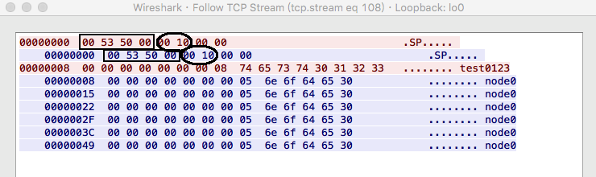
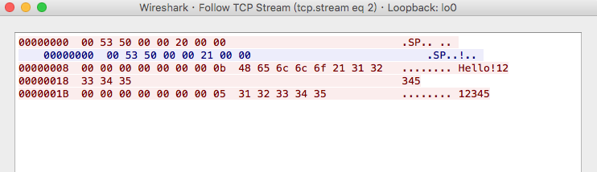
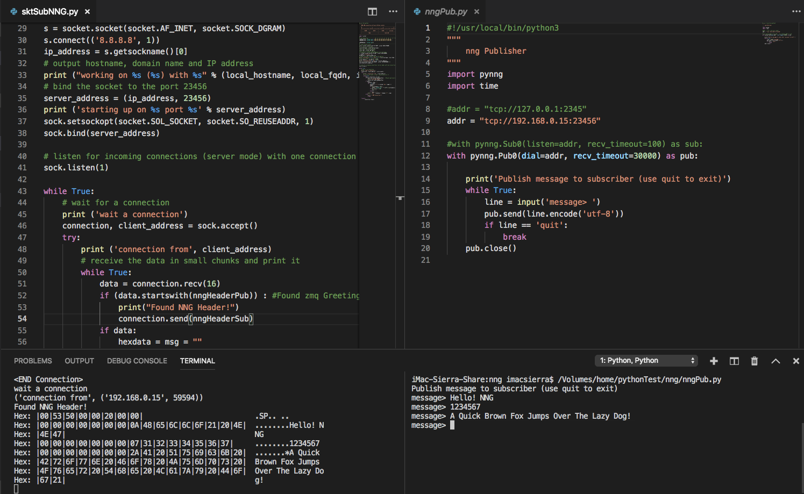

# nngSocket
  nng test stuff with Python and Arduino C++
   
   
  
  使用Python/Arduino sockets 模擬nng-PUB/SUB的Handshake 並發送接收訂閱資料
   
  
# References
  - [nng](https://github.com/nanomsg/nng)
  - [nanomsg RFC SP spec](https://github.com/nanomsg/nanomsg/blob/master/rfc/sp-tcp-mapping-01.txt)
  - [pynng](https://pypi.org/project/pynng/)
   
  
### NNG Pair Wireshark Dump

 
### NNG Pub/Sub Wireshark Dump

 
### Python Socket as Subscriber (for single publisher), pynng as Publisher
訂閱端 用Python Sockets, 發送端 使用pynng包裹libnng... 

