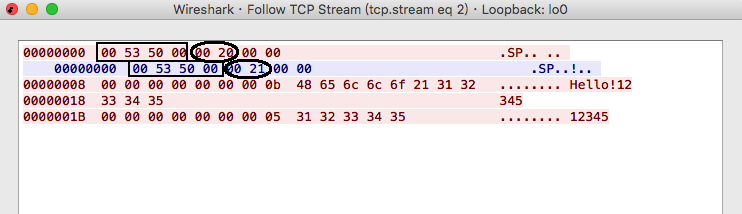

# nngSocket
  nng test stuff with Python and Arduino C++
   
  使用Python/Arduino sockets模擬nng-PUB/SUB的Handshake並發送接收訂閱資料
   
  
# References
  - [nanomsg RFC SP spec](https://github.com/nanomsg/nanomsg/blob/master/rfc/sp-tcp-mapping-01.txt)
   
### NNG Pair Wireshark Dump
  
   
### NNG Pub/Sub Wireshark Dump
  
   
### Python Socket as Subscriber, pynng as Publisher
  
